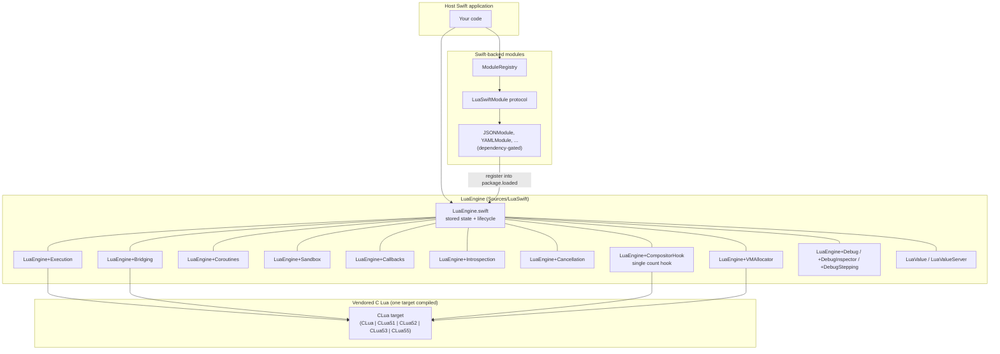
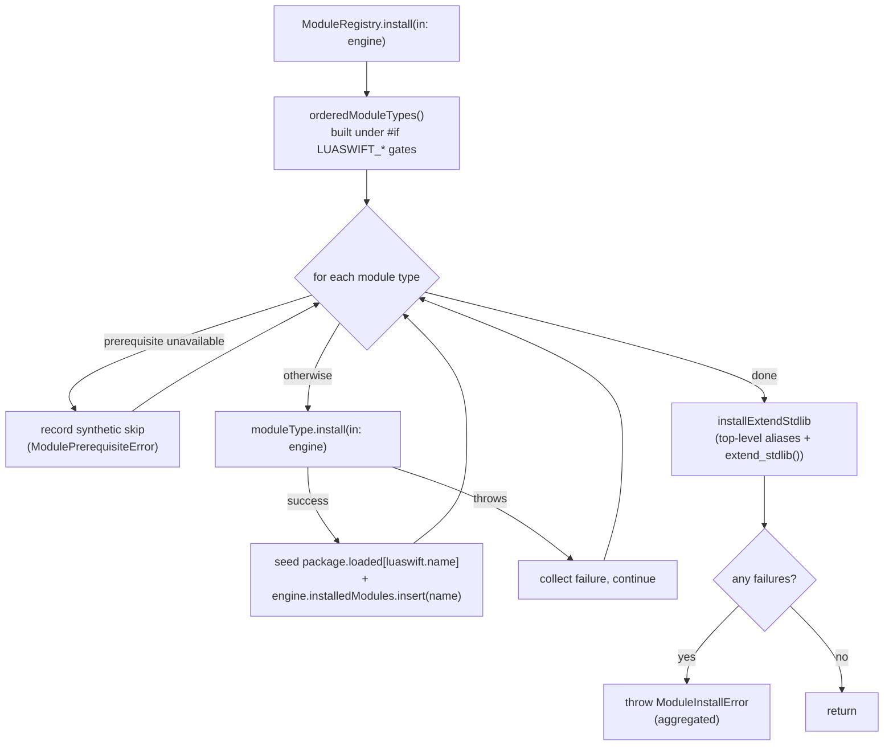

# LuaSwift Architecture

[← Back to Documentation Index](index.md)

This document describes how LuaSwift is structured for a reader who needs to
understand or extend the package: the `LuaEngine` core and how its behaviour is
spread across extension files, the vendored C Lua targets and version selection,
the Swift-backed module install flow, value bridging, the resource limits, the
sandbox model, and the optional-dependency build gates. Every claim below
reflects the current source in `Sources/`.

## High-level component map

## The `LuaEngine` core and its extension files

`LuaEngine` (a class) is the central abstraction: it owns a single `lua_State`
pointer (`L`), the locks/atomics that make it thread-safe, the callback and
value-server registries, and the init/deinit lifecycle. To keep each concern
readable, **only the stored state and lifecycle live in `LuaEngine.swift`** — all
the methods live in sibling `LuaEngine+*.swift` extension files. The current set:

| File | Responsibility |
|------|----------------|
| `LuaEngine.swift` | Stored state only: the `L` pointer, registries, locks, atomics, init/deinit |
| `LuaEngine+Execution.swift` | `run`/`evaluate`, the instruction-limit configuration, hook arming |
| `LuaEngine+Bytecode.swift` | Precompilation and the `CompiledChunk` value |
| `LuaEngine+FunctionCalls.swift` | Swift → Lua function calls |
| `LuaEngine+Callbacks.swift` | Lua → Swift callbacks (`registerFunction`) |
| `LuaEngine+Coroutines.swift` | Coroutine creation/resume management |
| `LuaEngine+CoroutineDebug.swift` | Debug-aware coroutine hook arming |
| `LuaEngine+ValueServer.swift` | Value-server registration (Swift data exposed to Lua) |
| `LuaEngine+Bridging.swift` | `LuaValue` ⇄ Lua stack conversion |
| `LuaEngine+Sandbox.swift` | Sandboxing and `require()` confinement |
| `LuaEngine+VMAllocator.swift` | The custom accounting allocator behind `vmMemoryLimit` |
| `LuaEngine+TLS.swift` | Thread-local-storage helpers and Swift memory tracking |
| `LuaEngine+Introspection.swift` | Globals/modules introspection (`installedModules`) |
| `LuaEngine+Cancellation.swift` | Cooperative cancellation (atomic flag) |
| `LuaEngine+CompositorHook.swift` | The single periodic count hook multiplexing limit + cancel + debug |
| `LuaEngine+Debug.swift` | Public debug-hook API |
| `LuaEngine+DebugInspector.swift` | The validity-scoped inspector for paused state |
| `LuaEngine+DebugStepping.swift` | Step-over/into/out decision logic |

Configuration is a separate value type, `LuaEngineConfiguration.swift`.

### The compositor hook

A key design point: LuaSwift installs **exactly one** `lua_sethook` count hook
per state (`LuaEngine+CompositorHook.swift`). That single hook multiplexes three
otherwise-competing concerns — cooperative cancellation, the instruction-count
limit, and debug-event dispatch — because Lua offers only one hook slot per
`lua_State`. The hook fires every `min(hookInterval, instructionLimit)`
instructions; when no debug handler is set, only `LUA_MASKCOUNT` is armed, so the
debug path costs nothing in the common case.

## Vendored C Lua targets and version selection

The Lua interpreter itself is vendored as C source under five sibling targets:

| Directory | Lua series | Bundled version |
|-----------|-----------|-----------------|
| `Sources/CLua` | 5.4 | 5.4.7 (default) |
| `Sources/CLua51` | 5.1 | 5.1.5 |
| `Sources/CLua52` | 5.2 | 5.2.4 |
| `Sources/CLua53` | 5.3 | 5.3.6 |
| `Sources/CLua55` | 5.5 | 5.5.0 |

**Version selection happens entirely in `Package.swift` at build time**, driven
by the `LUASWIFT_LUA_VERSION` environment variable (`51`/`52`/`53`/`54`/`55`,
default `54`). The selected value chooses the `path` and `sources` for a single
target named `CLua`, and sets a `LUA_VERSION_<n>` Swift define so Swift code can
branch on the version with `#if LUA_VERSION_*`. Notably, **every `CLua*`
directory's `module.modulemap` declares the module as `CLua`** — so the Swift
side always writes `import CLua` regardless of which version was compiled. Only
one C Lua target is ever compiled into a build.

Per-version C settings are also applied in `Package.swift`: 5.2 builds with
`LUA_COMPAT_ALL`, and 5.3 builds with `LUA_COMPAT_5_1` / `LUA_COMPAT_5_2`, so
`loadstring`/`unpack`-style compatibility shims are available.

The vendored sources are kept current by the `lua-version-check` GitHub workflow,
which detects new upstream releases and opens an update PR (see `TESTING.md` →
*Maintainer Runbook*).

## Module install flow

Swift-backed extension modules (JSON, YAML, TOML, regex, math, array, plot, …)
are installed through three collaborators:

- **`LuaSwiftModule`** (`Modules/LuaSwiftModule.swift`) — the protocol every
  module adopts. It exposes a stable `moduleName` and a single
  `static func install(in: LuaEngine) throws` that registers the module's Swift
  callbacks and runs its Lua setup code.
- **`ModuleRegistry`** (`Modules/ModuleRegistry.swift`) — the central installer.
  `ModuleRegistry.install(in:)` builds the ordered module list from
  `orderedModuleTypes()` and installs each one.
- **`package.loaded`** — each module's setup seeds
  `package.loaded["luaswift.<name>"]`, so Lua `require("luaswift.<name>")`
  resolves. A trailing `extend_stdlib` step wires the top-level aliases and the
  `luaswift.extend_stdlib()` helper after every module is installed.

Three properties of this flow matter:

1. **Order is load-bearing.** Within the NumericSwift block, `MathSciModule`
   precedes `MathExprModule` (it creates the `math.eval` namespace the latter
   consumes), and `SeriesModule` follows `MathExprModule` (it uses `eval`).
2. **Failures don't abort the loop.** Every per-module failure is collected and
   surfaced once through `ModuleInstallError` (`Modules/ModuleInstallError.swift`),
   so one broken module cannot hide the state of the others. A small prerequisite
   cascade records a synthetic `ModulePrerequisiteError` skip for a dependent
   whose prerequisite failed, rather than installing it against a half-built
   state.
3. **Introspection.** Each successful install is recorded in
   `LuaEngine.installedModules` (`LuaEngine+Introspection.swift`), but the
   `extend_stdlib` finalization step is *not* a module and is deliberately not
   recorded there.

## Value bridging: `LuaValue` ⇄ the Lua stack

Host code never manipulates the raw Lua C stack directly. `LuaValue`
(`LuaValue.swift`) is the Swift-side type-safe representation of a Lua value
(nil, boolean, number, string, table, function reference, …).
`LuaEngine+Bridging.swift` performs the conversion in both directions — pushing a
`LuaValue` onto the stack before a call, and reading results back off the stack
into `LuaValue` after one. `LuaValueServer` (`LuaValueServer.swift`) builds on
this to expose mutable Swift data to Lua (read/write) without copying it through
the stack on every access.

## Resource limits

LuaSwift offers three orthogonal limits, configured via
`LuaEngineConfiguration`:

- **Instruction limit** (`setInstructionLimit`, `LuaEngine+Execution.swift`) — a
  **CPU-bound control only**. The compositor count hook fires periodically; once
  the cumulative instruction count exceeds the limit it raises
  `LuaError.instructionLimitExceeded`. It bounds runtime, not memory.
- **`vmMemoryLimit`** (`LuaEngine+VMAllocator.swift`) — bounds **total Lua VM
  allocation** by installing a custom accounting allocator (`lua_Alloc`) that
  refuses allocations beyond the cap. Default `0` = disabled.
- **`memoryLimit`** — bounds buffers allocated by the **Swift-backed modules**.
  This *complements* `vmMemoryLimit` (it does not replace it): `memoryLimit`
  covers Swift-side buffers, `vmMemoryLimit` covers the VM heap. Default `0` =
  unlimited.

Because the instruction limit only bounds CPU, pairing it with a memory limit is
the way to bound a fully untrusted script on both axes.

## Sandbox model

When `LuaEngineConfiguration.sandboxed` is `true` (the default),
`LuaEngine+Sandbox.swift` hardens the state in several steps after the standard
libraries are opened:

- **Dangerous globals are removed**: `os.execute`, `os.exit`, `os.remove`,
  `os.rename`, `os.tmpname`, `os.getenv`, `os.setlocale`, and the file loaders
  `loadfile`/`dofile`/`loadstring`. (`os` is only *partially* restricted — safe
  functions like time/date remain.)
- **`package.loaded` is cleared for restricted libraries** (`io`, `debug`) so a
  later `require()` cannot restore them.
- **Dynamic loading is disabled**: `package.loadlib` is set to `nil` (no native
  libraries — also an App Store compliance requirement).
- **`require()` is confined**: `package.path`/`cpath` are cleared, and when a
  `packagePath` is configured, module loading is confined to that directory.

The removed-function list in the sandbox code is mirrored in
`LuaEngineConfiguration`'s documentation so the two stay in sync. The
`.unrestricted` preset skips all of this for trusted code.

## Optional-dependency build gates

Several modules depend on external Swift packages that are **opt-in at build
time**, controlled by `LUASWIFT_INCLUDE_*` environment variables read in
`Package.swift`. Each flag both adds the SPM dependency and sets a matching
`LUASWIFT_<NAME>` Swift define; `ModuleRegistry.orderedModuleTypes()` then adds
the corresponding modules under `#if LUASWIFT_<NAME>` so the module list matches
exactly what was compiled in.

| Flag | Default | Backing package | Adds |
|------|---------|-----------------|------|
| `LUASWIFT_INCLUDE_YAMS` | `1` (opt-out) | Yams | `luaswift.yaml` |
| `LUASWIFT_INCLUDE_TOMLKIT` | `0` (opt-in) | TOMLKit | `luaswift.toml` |
| `LUASWIFT_INCLUDE_NUMERICSWIFT` | `0` (opt-in) | NumericSwift | linalg, complex, mathsci, mathexpr, distributions, regress, series, … |
| `LUASWIFT_INCLUDE_ARRAYSWIFT` | `0` (opt-in) | ArraySwift | `luaswift.array` |
| `LUASWIFT_INCLUDE_PLOTSWIFT` | `0` (opt-in) | PlotSwift | `luaswift.plot` |

Two further build-time toggles are not module gates but worth noting:
`LUASWIFT_BOUNDED_INSPECTION` (caps the debug inspector's per-table breadth
against an adversarial breadth bomb), and `LUASWIFT_INCLUDE_THALES`, which is
currently **forced off** in `Package.swift` (issue #18) until the upstream API
stabilises.

Because the module list is gate-driven, a module is present at runtime only when
its backing dependency was compiled in — and `ModuleRegistry`'s aggregated error
reporting means a build configuration that omits a dependency simply omits the
module rather than failing.

---

[← Back to Documentation Index](index.md)
